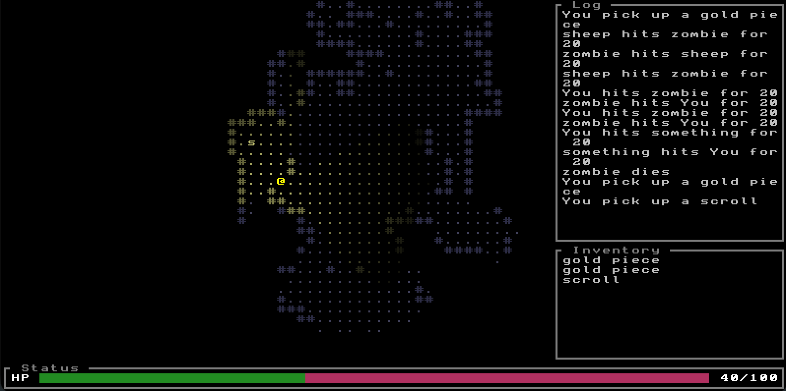

# korogue


[](LICENSE)

A reusable, extensible **roguelike game engine** written in Kotlin, rendering through
[kotile](kotile/README.md) (a general-purpose libGDX tile renderer developed in this repo).
korogue gives you the world/zone model, a lightweight entity–component system, the turn
loop, FOV/perception, lighting, AI, dungeon generation, save/load, and an ASCII UI toolkit;
you write Kotlin to fill in what your game *does*.

<p align="center">
  
  <br>
  <em>The demo (<code>./gradlew :demo:run</code>): shadowcast FOV and lantern lighting with previously-seen dimming, an event-bus-fed log and inventory sidebar, and an HP bar.</em>
</p>

Sprite tiles and ASCII tiles side by side — animated creatures, projectiles in flight (a rotating
sprite arrow with its glyph-missile counterpart), and flickering torch lighting — from the animation
showcase:

<p align="center">
  <video src="docs/images/animation.webm" controls loop muted playsinline width="800">
    <a href="docs/images/animation.webm">Watch the animation showcase (webm)</a>
  </video>
</p>

The showcase uses the [DawnLike](https://opengameart.org/content/dawnlike-16x16-universal-rogue-like-tileset-v181)
tileset (CC-BY 4.0), which isn't vendored in git. The task downloads it on first run:

```bash
./gradlew :demo:runAnimationShowcase  # auto-fetches DawnLike, then opens the live window
```

(That pulls in the `:demo:fetchDawnlikeAssets` task, which downloads into `demo/assets/dawnlike/`
and is a no-op once present; run it directly, with `-Pforce` to re-download, if you want the assets
without launching the showcase.)

> **Pre-release.** korogue is not on Maven Central yet — consume it via a Gradle composite
> build (see [Using korogue](#using-korogue)). The `com.sletmoe.korogue:engine` coordinate and
> `1.0` are still stabilizing.

## Features

- **Lightweight entity–component model** ([ADR-0002](docs/adr/0002-lightweight-component-entity-model.md)) —
  entities are containers of immutable component data classes; systems are plain functions that
  query by component set. Not archetype ECS, not OOP inheritance. Reified typed access
  (`get<T>()`, `require<T>()`, `has<T>()`); all writes go through a single `World` mutation seam.
- **Systems pipeline with enforced ordering** ([ADR-0032](docs/adr/0032-system-construction-and-the-standard-pipeline.md)) —
  built-in behaviour/movement/portal/combat/pickup/lighting/perception systems run each tick in a
  known-good order that `World.tick()` validates (a mis-order throws instead of silently corrupting
  state). Take the whole default pipeline in one call (`installStandardSystems`) or build your own.
- **Multi-zone worlds** ([ADR-0008](docs/adr/0008-active-only-multi-zone-simulation.md)) — by default
  only the player's current zone is simulated and rendered (`CurrentZoneOnly`) while others freeze in
  place and persist; the simulated set is a swappable `SimulatedZonePolicy` (`CurrentPlusAdjacent`, or
  your own) so neighbouring zones can keep ticking. Transitions are `Portal` entities resolved by
  `PortalSystem`.
- **Perception, senses, and concealment** ([ADR-0015](docs/adr/0015-visibility-and-perception.md)) —
  a two-phase reveal/suppress model with pluggable senses (`Sight`, `Darkvision`, `Tremorsense`,
  `Telepathy`, `TrueSight`), concealment (`Invisible`), and suppressors (`Blind`), cached per
  observer each tick.
- **Lighting** — per-zone light maps recomputed from `LightEmitter` entities, with an optional
  global-illumination baseline for games that don't model light per source.
- **Turn-based or real-time loop** — a pluggable `GameLoop`: tick once per committed player action,
  or continuously at a fixed timestep so game speed is independent of render FPS.
- **Timed effects** — a turn-keyed `Scheduler` of fuses (one-shot) and daemons (recurring),
  modelled on Rogue's `daemons.c`; fully serializable, so timers resume across save/load.
- **Save/load** ([ADR-0009](docs/adr/0009-save-load-and-registries.md)) — a CBOR codec over
  entities + terrain + a seeded, serializable RNG (so a seed reproduces a run and a save resumes
  it mid-stream) + per-zone fog memory + scheduler state.
- **Event bus** ([ADR-0010](docs/adr/0010-event-bus.md)) — decoupled, observe-only notifications
  (`EntityDamaged`, `EntityDied`, `ZoneChanged`, …) dispatched at end of tick, distinct from the
  intent-component mechanics pipeline.
- **ASCII UI toolkit** ([ADR-0011](docs/adr/0011-korogue-ui-toolkit.md)) — a retained-mode TUI
  widget layer (`MapPanel`, `Frame`, `Menu`, `Dialog`, `LogPanel`, `InventoryPanel`, `BarWidget`,
  `Label`, …) over kotile, composited and input-routed by `UiRoot`, and headlessly testable.
- **Extensible by registration** ([ADR-0014](docs/adr/0014-extensibility-ethos.md)) — plug AI
  strategies, light calculators, senses, timed effects, perception models, and your own
  `@Serializable` components into a `GameModule` by stable id.

The full, current design is in [docs/ARCHITECTURE.md](docs/ARCHITECTURE.md); the *why* behind each
decision is in [docs/adr/](docs/adr/).

## Quick start

A korogue game extends [`Game`](engine/src/main/kotlin/com/sletmoe/korogue/app/Game.kt) (a libGDX
`ApplicationAdapter`), builds a world and a content module, installs systems, and draws through the
UI toolkit each frame. An abbreviated sketch — imports, tile values, and cave parameters elided; see
the always-compiled demo below for the runnable version:

```kotlin
import com.sletmoe.korogue.algorithms.color.NormalizedRgb
import com.sletmoe.korogue.algorithms.zonegen.randomWalkCave
import com.sletmoe.korogue.app.Game
import com.sletmoe.korogue.components.*
import com.sletmoe.korogue.perception.*
import com.sletmoe.korogue.pipeline.installStandardSystems
import com.sletmoe.korogue.random.GameRandom
import com.sletmoe.korogue.registry.GameModule
import com.sletmoe.korogue.ui.MapPanel
import com.sletmoe.korogue.ui.UiRoot
import com.sletmoe.korogue.ui.WindowSurface
import com.sletmoe.korogue.utilities.IntRect
import com.sletmoe.korogue.world.GameWorld
import com.sletmoe.kotile.display.ascii.AsciiTileWindow

class HelloRogue : Game() {
    // Engine built-ins (senses, AI strategies, calculators, components). Register your own here.
    private val module = GameModule.engineDefaults().build()
    private val perception = module.perceptionModels.resolve(StandardPerception.ID)

    // Terrain + entities. The world owns its RNG, seeded here (a seed reproduces the run).
    private val world = GameWorld.create(GameRandom.random()) {
        zone("cave", width = 80, height = 40, isCurrentZone = true) {
            fill(wallTile); addFeature(randomWalkCave(startX, startY, length, floorTile))
        }
    }

    private val player = world.ecs.spawn(
        Position(10, 10),
        ZoneMember(world.currentZoneId),
        Renderable('@', NormalizedRgb.YELLOW, RenderLayer.PLAYER),
        Health(20, 20),
        Player,
        Sight(),        // senses the world by line of sight
        Perceived(),    // PerceptionSystem caches what the player sees here each tick
    ).id

    private val zoneFog = ZoneFog()   // per-zone "previously seen" memory, so explored areas stay drawn
    private lateinit var ui: UiRoot

    override fun buildWindow() = AsciiTileWindow.create { widthInTiles = 80; heightInTiles = 40 }

    override fun create() {
        super.create()
        // The whole default simulation in one call, in an order the engine enforces on tick().
        world.installStandardSystems(module, perception)
        ui = UiRoot(WindowSurface(window))
        // fogFor supplies each zone's remembered-cell grid; MapPanel defaults its observer to the player.
        ui.add(MapPanel(IntRect(0, 0, 80, 40), gameWorld = world, fogFor = { zone -> zoneFog.forZone(zone.zoneId, zone.width, zone.height) }))
    }

    override fun onKeyDown(keycode: Int) { /* set MoveIntent on the player, then world.ecs.tick() */ }
    override fun drawFrame(elapsedMs: Long) { window.clear(); ui.render(); window.render(elapsedMs) }
}
```

Two complete, always-compiled references show the real thing end to end:

- **[`demo/`](demo/src/main/kotlin/com/sletmoe/korogue/demo/MyGame.kt)** — the in-repo demo:
  a two-zone world, the standard pipeline, FOV/lighting, an event-bus-fed sidebar, save/load, and
  modal menus. Run it with `./gradlew :demo:run`.
- **[korogue-rogue](https://github.com/ksletmoe/korogue-rogue)** — a full game (see below).

## A complete game built on korogue

**[korogue-rogue](https://github.com/ksletmoe/korogue-rogue)** is a faithful, playable
reimplementation of *Rogue 5.4.4* built entirely on this engine — the best example of what a real
game on korogue looks like, and the **canonical external-consumer test** of the public API
([ADR-0012](docs/adr/0012-rogue-example.md)). Living in its own repo and depending on korogue like
any downstream game, it implements a multi-level dungeon, the monster roster, the full item set
(weapons, armor, rings, wands, scrolls, potions, food, the Amulet of Yendor), combat, hunger, traps,
leveling, status effects, save/restore, and the Top Ten scoreboard. It builds its own system
pipeline by hand — a few engine built-ins interleaved with ~17 of its own systems — plus many custom
`@Serializable` components, exercising
the registries, perception overrides (room-based sight), the scheduler, and the save codec as a true
consumer. If you're learning the engine, read it alongside the in-repo demo.

## Using korogue

korogue isn't published to Maven Central yet, so consume it as a Gradle **composite build** (the
approach korogue-rogue uses). Clone this repo next to your consumer project and include its build:

```kotlin
// settings.gradle.kts
includeBuild("../korogue")
```

```kotlin
// build.gradle.kts — the composite substitutes group:name onto the local :engine project.
dependencies {
    implementation("com.sletmoe.korogue:engine:1.0.0-LOCAL")

    // A libGDX backend + natives to open a window (the engine brings kotile + gdx-core transitively).
    implementation("com.badlogicgames.gdx:gdx-backend-lwjgl3:1.14.1")
    runtimeOnly("com.badlogicgames.gdx:gdx-platform:1.14.1:natives-desktop")
}
```

## Module layout

A Gradle multi-project build ([ADR-0013](docs/adr/0013-monorepo-and-module-layout.md)); the root is
a pure aggregator with no production sources.

- **`:engine`** — the korogue engine library (`com.sletmoe.korogue`). Exposes kotile as an `api`
  dependency, since kotile types appear in its public API (`Game`, `TileSurface`).
- **`:demo`** — the runnable demo (`MyGame` / `Main`), consuming `:engine`. Not published.
- **`:kotile:library`** — kotile, the tile renderer (`com.sletmoe:kotile`), published on its own
  coordinates from this same repo. See [kotile/README.md](kotile/README.md).
- **`:kotile:demo`** — kotile's own renderer showcase.

## Build & test

```bash
./gradlew test                    # full Kotest suite, all modules
./gradlew :engine:compileKotlin   # quick compile check of the engine
./gradlew :demo:run               # run the demo (macOS -XstartOnFirstThread is wired in)
./gradlew build                   # compile, assemble, test, ktlint
```

Built with Gradle 9.5.1, Kotlin 2.3.21 (JDK 21 toolchain), and libGDX 1.14.1. A checked-in
`pre-commit` hook runs `ktlintFormat` on staged Kotlin; it's installed automatically on the first
`./gradlew check`/`build`.

Contributions are welcome — see [CONTRIBUTING.md](CONTRIBUTING.md) for setup, the beads (`bd`)
workflow this project tracks work in, and PR expectations.

## License

korogue is released under the [BSD 3-Clause License](LICENSE).
