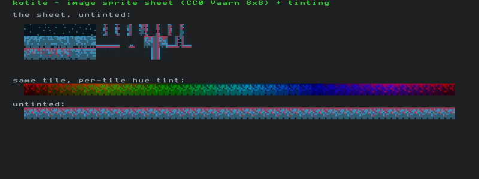

# kotile

A small Kotlin/JVM library for rendering grids of tiles, built on
[libGDX](https://libgdx.com/). It supports two tile styles on one rendering
core:

- **Image sprite sheets** — slice any image into tiles and draw them, with an
  optional per-tile color tint and a selectable transparency key.
- **ASCII tiles** — a CP437 bitmap font drawn as foreground/background colored
  cells (roguelike style).

Rendering is immediate-mode and GPU-batched: you hold the tile state in memory
and redraw the visible grid each frame via a `SpriteBatch`.



> The demo above: the bundled CC0 sprite sheet drawn untinted (top), the same
> tile recolored with a per-tile hue tint (middle), an untinted row, and ASCII
> labels — all in one frame.

## Project layout

A Gradle multi-module build:

- **`:library`** — the published artifact `com.sletmoe:kotile`. Depends only on
  **gdx core**, so you bring your own gdx backend.
- **`:demo`** — a runnable LWJGL3 application showcasing both tile styles.

## Using the library

Publish it to your local Maven repository:

```bash
./gradlew :library:publishToMavenLocal
```

Then depend on it, adding a gdx backend for your target platform (desktop shown):

```kotlin
repositories {
    mavenLocal()
    mavenCentral()
}

dependencies {
    implementation("com.sletmoe:kotile:1.0-SNAPSHOT")

    implementation("com.badlogicgames.gdx:gdx-backend-lwjgl3:1.14.1")
    runtimeOnly("com.badlogicgames.gdx:gdx-platform:1.14.1:natives-desktop")
}
```

### Consuming kotile via composite build

If you are developing kotile alongside your project and want to use
`includeBuild` instead of publishing to Maven Local, add a
`dependencySubstitution` block. Without it Gradle reports
"No variants exist" because kotile's root project is a container — the
publishable artifact is in the `:library` sub-project.

In your consumer's `settings.gradle.kts`:

```kotlin
includeBuild("../kotile") {
    dependencySubstitution {
        substitute(module("com.sletmoe:kotile")).using(project(":library"))
    }
}
```

Your `build.gradle.kts` dependency declaration stays the same:

```kotlin
dependencies {
    implementation("com.sletmoe:kotile:1.0-SNAPSHOT")
}
```

Gradle will substitute the source project at build time and recompile
kotile alongside your project automatically.

### ASCII tiles

```kotlin
import com.badlogic.gdx.ApplicationAdapter
import com.badlogic.gdx.Gdx
import com.badlogic.gdx.graphics.Color
import com.badlogic.gdx.graphics.GL20
import com.badlogic.gdx.backends.lwjgl3.Lwjgl3Application
import com.badlogic.gdx.backends.lwjgl3.Lwjgl3ApplicationConfiguration
import com.sletmoe.kotile.display.ascii.AsciiTileDescriptor
import com.sletmoe.kotile.display.ascii.AsciiTileWindow

class HelloKotile : ApplicationAdapter() {
    private lateinit var window: AsciiTileWindow

    override fun create() {
        window = AsciiTileWindow.create {
            widthInTiles = 80
            heightInTiles = 30
        }
        window.fill(AsciiTileDescriptor(' ', Color.WHITE, Color.valueOf("1d1f21ff")))
        window.drawText(2, 1, "Hello, kotile!", Color.LIME, Color.CLEAR)
    }

    override fun render() {
        Gdx.gl.glClear(GL20.GL_COLOR_BUFFER_BIT)
        window.render()
    }

    override fun dispose() = window.dispose()
}

fun main() {
    Lwjgl3Application(
        HelloKotile(),
        Lwjgl3ApplicationConfiguration().apply {
            setTitle("kotile")
            setWindowedMode(800, 300)
        },
    )
}
```

### Image sprite sheets

```kotlin
import com.badlogic.gdx.Gdx
import com.badlogic.gdx.graphics.Color
import com.sletmoe.kotile.display.KotileCanvas
import com.sletmoe.kotile.rendering.SpriteTileRenderer
import com.sletmoe.kotile.tiles.StaticTile
import com.sletmoe.kotile.tiles.TileSheet

// 16x16 tiles; pixels that are exactly magenta become transparent.
val sheet = TileSheet(Gdx.files.internal("tiles.png"), tileWidthPx = 16, tileHeightPx = 16, keyColor = Color.MAGENTA)
val renderer = SpriteTileRenderer(KotileCanvas(16, 16), sheet)

// Draw sheet cell (1,4) at grid (3,2) on layer 0, in its own colors:
renderer.drawTile(x = 3, y = 2, z = 0, staticTile = StaticTile(sheetX = 1, sheetY = 4))
// ...and again, recolored via a tint (white = unchanged):
renderer.drawTile(x = 4, y = 2, z = 0, staticTile = StaticTile(sheetX = 1, sheetY = 4, tint = Color.RED))

// each frame:
renderer.render()
```

`TileSheet` also accepts `margin` and `spacing` (Tiled-style) for sheets with
borders and gaps between tiles.

## Running the demo

```bash
./gradlew :demo:run
```

In a headless environment you need a virtual display with software OpenGL; the
demo can render a single frame to a PNG and exit:

```bash
./gradlew :demo:installDist -q
LIBGL_ALWAYS_SOFTWARE=1 GALLIUM_DRIVER=llvmpipe \
  KOTILE_OPTS="-Dkotile.snapshot=$PWD/render.png" \
  xvfb-run -a -s "-screen 0 1024x768x24" demo/build/install/kotile/bin/kotile
```

## Building, testing, docs

```bash
./gradlew build                                       # compile, assemble, test
./gradlew :library:test                               # unit tests
xvfb-run -a ./gradlew :library:test --no-daemon       # + headless GL integration tests
./gradlew :library:dokkaGenerate                      # API docs -> library/build/dokka/html
```

Built with Gradle 9.5.1, Kotlin 2.3.21 (JDK 21 toolchain), and libGDX 1.14.1.
See [AGENTS.md](AGENTS.md) for a deeper tour of the architecture.

## License

kotile is released under the [BSD 3-Clause License](LICENSE).

## Credits

The demo sprite sheet (`demo/src/main/resources/vaarn-8x8.png`) is from the
[Vaarn Tilesets](https://github.com/vaarn/vaarn-tilesets) project, released
under CC0 1.0 (public domain). See its accompanying `*.license.txt`.
